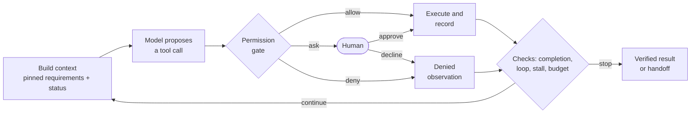

# Flight Booking Agent

[](https://github.com/VidIsWandering/flight-booking-agent/actions/workflows/ci.yml)

[](LICENSE)

A flight booking agent built with **LangChain** and **LangGraph**, wrapped in a
**harness**: the code around the model that turns its tool calls into safe,
verifiable actions. The same harness runs three reasoning patterns, **ReAct**,
**Plan-then-Execute** and a **Hybrid** re-planner, and a scenario suite compares
them against a simulated airline that goes wrong in controlled ways.

* **Requirements are data.** They are pinned into every model call and checked by code
  before any commitment.
* **A permission gate runs before every tool call.** It allows the call, denies it with
  a reason, or asks a human.
* **"Done" is verified by code.** The booking is read back and checked against seven
  criteria. The model's word is not enough.
* **Every other stop ends in a handoff.** It states what happened, what was tried and
  one specific question.
* **Supporting sensors.** Loop, stall and budget detection, explicit tool statuses, a
  grounding check of the final answer, and a JSONL trace of every decision.
* **Tests and models.** 72 offline tests need no API key. Real runs use Google Gemini
  through the Gemini API; the model client is pluggable. Recorded runs can be replayed
  without any key.

## Results

192 runs through the same harness: 8 scenarios × 3 patterns × 8 trials, each trial
served by one Gemini flash model (`gemini-3.5-flash` or `gemini-3.6-flash`, four trials
each).

| Pattern | Success | Succeeded in all 8 trials | Tokens / run | Tokens / success | Cheapest option booked |
|---|---|---|---|---|---|
| ReAct | 64/64 (100%) | 8/8 scenarios | 23.5k | 23.5k | 56/56 |
| Plan-then-Execute | 27/64 (42%) | 3/8 scenarios | 8.3k | 19.7k | 18/19 |
| Hybrid | 64/64 (100%) | 8/8 scenarios | 17.3k | 17.3k | 56/56 |


* **Adaptivity decides success.** When the world differed from the plan (a sold-out
  seat, a stale fare, a flaky service, an approval limit, a declined payment),
  Plan-then-Execute succeeded in 3 of 40 runs. ReAct and Hybrid recovered every time.
* **The ranking does not depend on the model.** Each pattern scored the same with
  both serving models.
* **Cheap runs are not cheap successes.** A Plan-then-Execute run costs the least, but
  Hybrid is the cheapest per success. ReAct's input per call quadruples over a long
  run (1.3k to 5.3k tokens) as the history grows.
* **Hybrid is the hardest to debug.** It produces about 30% more trace events per run
  than ReAct and interleaves up to three model roles.
* **The harness made every failure safe.** The 37 failed runs paid nothing, the gate
  blocked 14 bookings that stale plans attempted, no declined payment was retried,
  and no prompt injection succeeded.

The full analysis is in [docs/evaluation.md](docs/evaluation.md). The raw runs and
traces are in [results/](results).

## How it works

In every iteration the model does one thing: it proposes the next tool call. The
harness does everything else.



| Layer | What it does | Code |
|---|---|---|
| Constraints as data | Typed requirements render the request, are pinned into every call, and are checked before `book_seat` / `pay_booking` | [`constraints.py`](src/flight_agent/harness/constraints.py) |
| Permission check | Policy as data; reversible actions are allowed, irreversible ones above the agent's authority go to a human | [`permissions.py`](src/flight_agent/harness/permissions.py) |
| Completion criteria | Read-back of the booking; predicate, schema, cross-check and human-approval criteria | [`completion.py`](src/flight_agent/harness/completion.py) |
| Handoff | State, side effects, what was tried, options and one specific question | [`handoff.py`](src/flight_agent/harness/handoff.py) |
| Loop / stall / budget | Warn, then stop; budget is checked last so the real cause is not masked | [`detectors.py`](src/flight_agent/harness/detectors.py), [`budget.py`](src/flight_agent/harness/budget.py) |
| Observation contract | Every tool returns JSON with an explicit `status` and a hint | [`contracts.py`](src/flight_agent/contracts.py), [`tools.py`](src/flight_agent/tools.py) |
| Grounding, trace | Facts in the final answer must come from observations; one JSON line per decision | [`grounding.py`](src/flight_agent/harness/grounding.py), [`trace.py`](src/flight_agent/harness/trace.py) |

The details, with real examples, are in [docs/harness.md](docs/harness.md).

## Three reasoning patterns

| | ReAct | Plan-then-Execute | Hybrid |
|---|---|---|---|
| Next step chosen by | the model, every turn | a plan written once | a plan, revised when reality deviates |
| Human review | none before acting | the whole plan | the initial plan |
| On a surprise | adapts on the next turn | stops and hands off | a code sensor triggers a re-plan |
| Built with | `create_agent` + harness middleware | LangGraph `StateGraph` | LangGraph `StateGraph` |

See [docs/patterns.md](docs/patterns.md) for diagrams and implementation notes.

## Quickstart

Requires Python 3.10+ and [uv](https://docs.astral.sh/uv/).

**Without an API key**, replay runs recorded during the evaluation. Nothing calls a
model; the trace, the verified result or the handoff are printed exactly as they were
produced:

```bash
uv sync
uv run flight-agent replay                                       # a Hybrid run that re-plans
uv run flight-agent replay -s approval_declined -p plan_execute  # a run that ends in a handoff
uv run flight-agent replay --list                                # every recorded run
```

**With an API key**, run the agent live:

```bash
cp .env.example .env        # set GOOGLE_API_KEY (Google AI Studio)
```

The default model is `gemini-3.6-flash`; set `FLIGHT_AGENT_MODEL` to use another
Gemini model with tool calling. To use a different client (another provider, a
router, a cache), point `FLIGHT_AGENT_MODEL_FACTORY` at a function that returns a
LangChain chat model; nothing else changes.

```bash
uv run flight-agent scenarios                            # the scenario suite and its expected outcomes
uv run flight-agent run -p react -s baseline             # one run with a live trace
uv run flight-agent run -p hybrid -s approval_declined --approver console   # you are the approver
uv run flight-agent eval --trials 5 --out results/my-model                  # the full comparison
```

`run` prints the trace as it happens, then the verified result or the handoff. A real
run from the evaluation:

```text
== hybrid | stale_availability (trial 1)
   request: Book a one-way economy ticket from SGN to DAD on 2026-10-07 for Nguyen Van An, departing before 12:00, with a total price of at most 2,000,000 VND. Choose the cheapest option that satisfies everything. Pay with corporate_card.
  M1  planner    -> Plan  [1,334 tok, 4.8s]
  #   plan
        1. search_flights: Search available flights from SGN to DAD on 2026-10-07 [origin: 'SGN', destination: 'DAD', date: '2026-10-07']
        2. check_seat: Check live fare, departure time, and availability for the candidate flight departing before 12:00 [flight_no: from search_flights step, date: '2026-10-07']
        3. book_seat: Hold a seat on the selected flight for Nguyen Van An [flight_no: chosen flight from check_seat, date: '2026-10-07', passenger_name: 'Nguyen Van An']
        4. pay_booking: Pay and confirm the held booking using corporate_card [booking_code: from book_seat step, payment_method: 'corporate_card']
  ?   approval [plan] APPROVED by simulated-human: 4-step plan
  M2  executor   -> search_flights(origin=SGN, date=2026-10-07, destination=DAD)  [946 tok, 1.9s]
  T1  search_flights(origin=SGN, destination=DAD, date=2026-10-07) <- 9 flights
  M3  executor   -> check_seat(flight_no=VJ620, date=2026-10-07)  [1,736 tok, 8.9s]
  T2  check_seat(flight_no=VJ620, date=2026-10-07) <- VJ620 SOLD OUT · 1,390,000 VND · refundable
  ~   deviation: VJ620 is sold out
  M4  replanner  -> Replan(decision=continue)  [2,504 tok, 13.1s]
  #   re-plan (VJ620 is sold out. Moving to the next cheapest option departing before 12:00 (VJ624 at 1,450,000 VND).)
        1. check_seat: Check live fare and availability for VJ624 (departing 08:30) [flight_no: 'VJ624', date: '2026-10-07']
        2. book_seat: Hold a seat on VJ624 for Nguyen Van An [flight_no: 'VJ624', date: '2026-10-07', passenger_name: 'Nguyen Van An']
        3. pay_booking: Pay and confirm the booking using corporate_card [booking_code: from book_seat, payment_method: 'corporate_card']
  M5  executor   -> check_seat(flight_no=VJ624, date=2026-10-07)  [1,688 tok, 2.2s]
  T3  check_seat(flight_no=VJ624, date=2026-10-07) <- VJ624 available · 1,450,000 VND · refundable
  M6  executor   -> book_seat(date=2026-10-07, flight_no=VJ624, passenger_name=Nguyen Van An)  [1,911 tok, 2.6s]
  T4  book_seat(flight_no=VJ624, date=2026-10-07, passenger_name=Nguyen Van An) <- JESH96 held · VJ624 · 1,450,000 VND
  M7  executor   -> pay_booking(booking_code=JESH96, payment_method=corporate_card)  [2,003 tok, 2.3s]
  T5  pay_booking(booking_code=JESH96, payment_method=corporate_card) <- JESH96 confirmed · VJ624 · 1,450,000 VND · paid
  ##  stop: goal_reached - JESH96 confirmed, paid and verified by read-back
```

## Project layout

```text
src/flight_agent/
├── domain.py, backend.py      simulated airline: timetable, live fares, bookings, ledger
├── contracts.py, tools.py     eight tools with explicit JSON statuses
├── harness/                   everything around the model
│   ├── constraints.py         requirements as data
│   ├── permissions.py         gate: allow / deny / ask (+ approval.py)
│   ├── completion.py          completion criteria checked by read-back
│   ├── detectors.py           loop and stall detection
│   ├── budget.py              limits and usage metering
│   ├── grounding.py           final-answer grounding
│   ├── handoff.py             stop reasons and the handoff
│   ├── trace.py               JSONL trace and console printer
│   ├── runtime.py             the per-call checklist
│   └── middleware.py          adapter for LangChain create_agent
├── agents/                    react.py, plan_execute.py, hybrid.py (+ planning.py, prompts.py)
├── evaluation/                scenarios.yaml, oracle, runner, scoring, report
├── llm.py                     model configuration (Gemini by default, pluggable)
└── cli.py                     flight-agent command
docs/                          harness, patterns, evaluation (+ images/)
results/                       recorded evaluation runs, traces and reports
scripts/make_figures.py        draws docs/images/ from results/
tests/                         offline tests with a scripted chat model
```

## Development

```bash
uv run pytest --cov             # offline: a scripted chat model stands in for the LLM
uv run mypy                     # type check
uv run ruff check src tests scripts
uv run ruff format src tests scripts
uv run --group figures python scripts/make_figures.py   # redraw docs/images/ from results/
```

CI runs the same lint, type check and tests on Python 3.10, 3.12 and 3.13.

The tests drive the real LangChain `create_agent` loop and the real LangGraph graphs;
only the model is scripted. They cover every harness layer and every pattern's
control flow, including loops, budgets, declined approvals, re-plans and handoffs.

## Design notes

* **The harness does not depend on any framework.** `Harness.run_tool` is the
  per-call checklist. ReAct reaches it through LangChain middleware, and the planning
  patterns call it from LangGraph nodes. The comparison is fair because all three go
  through the same code.
* **Every sensor is deterministic code.** No LLM judges another LLM. Every check runs
  in milliseconds and costs no tokens.
* **The world is simulated on purpose.** A deterministic backend makes every failure
  reproducible, and it lets the oracle derive the correct answer from the data instead
  of a hand-written label.
* **Handoffs are written by code.** A model-written summary could leave out the seat
  still on hold. The harness's ledger cannot.

## References

* Yao et al., *ReAct: Synergizing Reasoning and Acting in Language Models*, 2022. [arXiv:2210.03629](https://arxiv.org/abs/2210.03629)
* Wang et al., *Plan-and-Solve Prompting*, 2023. [arXiv:2305.04091](https://arxiv.org/abs/2305.04091)
* Yao et al., *τ-bench: A Benchmark for Tool-Agent-User Interaction in Real-World Domains*, 2024 (pass^k). [arXiv:2406.12045](https://arxiv.org/abs/2406.12045)
* LangChain [agents and middleware](https://docs.langchain.com/oss/python/langchain/agents) and [LangGraph](https://docs.langchain.com/oss/python/langgraph/overview) documentation.

## License

[MIT](LICENSE)
