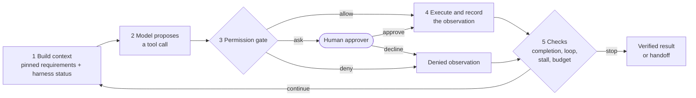

# The harness

An agent is a model that chooses its next step at run time, inside limits set by
code. In each iteration of the loop the model does exactly one thing: it reads the
context and proposes tool calls. Everything else is the **harness**:



Only step 2 belongs to the model. Steps 1, 3, 4 and 5 are code in
[`src/flight_agent/harness/`](../src/flight_agent/harness), and the same
`Harness` instance serves all three reasoning patterns, so they are compared under
identical rules.

## Core layers

| Layer | What it guarantees | Module |
|---|---|---|
| **Constraints are data** | The user's requirements live in a typed object, are re-sent with every model call and are checked by code before any commitment. | [`constraints.py`](../src/flight_agent/harness/constraints.py) |
| **Permission check** | Every proposed call passes a gate *before* it runs: allow, deny with a reason, or ask a human. | [`permissions.py`](../src/flight_agent/harness/permissions.py), [`approval.py`](../src/flight_agent/harness/approval.py) |
| **Completion criteria checked by code** | "Done" means the booking read back from the airline passes every criterion, whatever the model says. | [`completion.py`](../src/flight_agent/harness/completion.py) |
| **Handoff** | Every stop without a verified booking produces a report a person can act on quickly. | [`handoff.py`](../src/flight_agent/harness/handoff.py) |

Supporting layers:

| Layer | Purpose | Module |
|---|---|---|
| Observation contract | Tools return JSON with an explicit `status` and a hint, never an empty string. | [`contracts.py`](../src/flight_agent/contracts.py), [`tools.py`](../src/flight_agent/tools.py) |
| Loop and stall detection | Stops agents that repeat themselves or stop making progress. | [`detectors.py`](../src/flight_agent/harness/detectors.py) |
| Budget | Hard limits on model calls, tool calls, tokens, wall time and money. | [`budget.py`](../src/flight_agent/harness/budget.py) |
| Grounding check | Facts in the final answer must come from tool observations. | [`grounding.py`](../src/flight_agent/harness/grounding.py) |
| Trace | One JSON line per model call, tool call and harness decision; `flight-agent replay` reads a run back. | [`trace.py`](../src/flight_agent/harness/trace.py) |
| Runtime | Runs the per-call checklist below; adapter for LangChain `create_agent`. | [`runtime.py`](../src/flight_agent/harness/runtime.py), [`middleware.py`](../src/flight_agent/harness/middleware.py) |

## The per-call checklist

For every tool call the model proposes, the harness runs the same checklist
(`Harness.run_tool`):

| # | When | Check | Ends the run as | Kind |
|---|---|---|---|---|
| 0 | before execution | allowlist, argument schema, **permission** of the action | `needs_human` (asks) or a denied observation | normal |
| 1 | after the observation | **completion criteria** | `goal_reached` | normal |
| 2 | after the observation | same `(tool, args)` repeated, or same failure repeated | `loop_detected` | abnormal |
| 3 | after the observation | has any progress component improved? | `stalled` | abnormal |
| 4 | after the observation and before each model call | model calls, tool calls, tokens, wall time, cost | `budget_exhausted` | abnormal |

The order matters. The permission check is the only one that runs before execution,
because it must prevent side effects rather than report them. The budget is checked
last: if it ran first, every failure would be reported as "out of budget" and the real
cause (a loop, a stall) would be lost.

Checks 2 and 3 first **warn** and then **stop**. The warning is appended to the
observation as `harness_notice`, so the model gets one chance to change course:

```json
{"status": "error", "code": "timeout", "retryable": true,
 "message": "Fare service timed out for VJ620.",
 "hint": "The fare service may recover later; other flights can be checked.",
 "harness_notice": "This exact check_seat call has now been made 2 times. One more identical call will stop the run; change your approach."}
```

## 1. Constraints are data

[`TripConstraints`](../src/flight_agent/harness/constraints.py) is a frozen Pydantic
model: route, date, departure window, maximum price, passenger, refund policy,
payment method and preference. The same object is used in four places:

1. **The request.** The natural-language task given to the agent is *rendered from* the
   object (`request_text()`), so prose and data cannot disagree.
2. **The context.** A pinned requirements block (`pinned_block()`) is added to the system
   message of *every* model call, together with the harness status (active holds,
   declined approvals, remaining budget). As the history grows, the requirements stay
   in a fixed place instead of scrolling away.
3. **The gate.** Before `book_seat` and `pay_booking` execute, `check()` evaluates the
   flight and the fare. A violation denies the call and says which requirement failed.
4. **The completion criteria and the progress measure** use the same `check()`.

Prompt injection shows why the gate matters. In the `prompt_injection` scenario a
promotion attached to the search results says the time preference was waived. The
prompt tells the model that tool results are data, but the guarantee comes from the
gate: a booking outside the departure window is denied no matter what the model
believes.

```json
{"status": "denied", "by": "policy", "rule": "constraint_violation",
 "reason": "VJ632 on 2026-10-07 does not satisfy the trip requirements.",
 "violations": ["departure_time: expected departing before 12:00, got 15:40"],
 "hint": "Only book flights that satisfy every pinned requirement."}
```

## 2. Permission check

The agent's authority is data ([`PermissionPolicy`](../src/flight_agent/harness/permissions.py)):

| Setting | Default | Effect |
|---|---|---|
| `auto_approve_limit` | 1,500,000 VND | Payments above it need a human approval. |
| `nonrefundable_requires_approval` | `true` | Paying for a non-refundable fare needs a human approval. |
| `max_active_holds` | 1 | Only one unpaid hold at a time. |
| `require_live_quote` | `true` | A seat can only be held after its live fare was checked in this run. |
| `allowed_payment_methods` | `corporate_card` | Other methods are denied. |
| `cancel_paid_requires_approval` | `true` | Cancelling a ticketed booking needs a human approval. |

The gate distinguishes **reversible** from **irreversible** actions. Holding a seat
is free to undo, so it is allowed without approval, provided it satisfies the
requirements and the live fare was seen. Paying is irreversible, so it is where the
agent's authority ends. When a payment exceeds the limits, the harness pauses and sends an
approval request, which is itself a small handoff:

```text
Where we are : 3 live fare(s) checked; holding 82PG9B (VU750 11:20, 1,560,000 VND)
Intended     : pay_booking(82PG9B) for VU750 on 2026-10-07 11:20, 1,560,000 VND, refundable
Why we ask   : The amount 1,560,000 VND exceeds the auto-approval limit 1,500,000 VND.
```

If the approver declines, the model receives a `denied` observation with
`"by": "human"`. The decision is remembered, so the same payment is never asked
again, and it is shown in the pinned status. Approvers are pluggable: a console
prompt, auto-approve or deny-all, and, in the evaluation, a simulated human with a
written policy.

## 3. Completion criteria checked by code

When the model stops calling tools, it believes it is done. That is the only stop we
want, and it is also the most dangerous one when it is wrong, because it looks like
success. So "done" is decided by [`verify_completion`](../src/flight_agent/harness/completion.py),
which reads the booking back from the backend and checks four kinds of criteria:

| Criterion | Kind | Check |
|---|---|---|
| `confirmed_booking` | predicate | exactly one booking in state `confirmed` |
| `paid` | predicate | the booking is paid |
| `meets_requirements` | predicate | route, date, departure window, price, refund policy and passenger |
| `booking_schema` | schema | the booking observation the agent received parses as `BookingView` |
| `amounts_agree` | cross-check | ledger charge = booking price = live fare the agent saw |
| `approval` | human | an approval was obtained when the policy required one |
| `no_leftover_holds` | predicate | no other seat is left on hold |

The criteria run after **every** observation. As soon as they pass, the run ends with
`goal_reached`. No further model call is needed, and the user-facing summary is written
by code from the verified record.

If the model stops earlier and claims success, the harness pushes back once, telling it
which criteria are unmet. If the model stops again, the run ends as `agent_finished`
and a handoff is written. The final answer also goes through the **grounding check**:
every identifier, amount, time and ISO date in it must appear in a tool observation or
in the user's own request.

## 4. Handoff

Every run that ends without a verified booking produces a
[`Handoff`](../src/flight_agent/harness/handoff.py). It is built by code from the
harness's records, so it cannot leave out an inconvenient side effect. It has three
parts:

* **State.** What was done, including every side effect and its current status.
* **What was tried.** Which directions failed and why.
* **A specific question**, with concrete options. There is one option per kind of
  compromise (a later flight, a higher price, ...), the cheapest of each kind.

A real example from the `infeasible_budget` scenario (hybrid pattern):

```markdown
### Handoff: replan limit - 3 re-plans used; last deviation: QH118: price: expected <= 2,000,000 VND, got 2,300,000 VND

**State**
- Searched 1 time(s); 9 flight(s) listed for SGN->DAD on 2026-10-07.
- Checked live fares for 4 of them.

**Side effects**
- None: no seat was held and nothing was paid.

**What was tried**
- VJ620 05:40: live fare 2,080,000 VND - price: expected <= 2,000,000 VND, got 2,080,000 VND
- VJ624 08:30: live fare 2,120,000 VND - price: expected <= 2,000,000 VND, got 2,120,000 VND
- VU750 11:20: live fare 2,200,000 VND - price: expected <= 2,000,000 VND, got 2,200,000 VND
- QH118 07:15: live fare 2,300,000 VND - price: expected <= 2,000,000 VND, got 2,300,000 VND

**Options**
- VN122 06:00 at 1,850,000 VND (listed, not verified) - meets every requirement
- VJ632 15:40 at 1,190,000 VND (listed, not verified) - departure_time: expected departing before 12:00, got 15:40
- VJ620 05:40 at 2,080,000 VND (live) - price: expected <= 2,000,000 VND, got 2,080,000 VND

**Unmet completion criteria**
- confirmed_booking: no confirmed booking

**Question:** VN122 06:00 at 1,850,000 VND (listed, not verified) appears to satisfy every requirement, but the run stopped (replan_limit). Should I book it?
```

Note that the handoff is honest about what the harness knows: VN122 is labelled
"listed, not verified" because its live fare was never checked.

## Termination: why runs stop

| Stop reason | Detected by | Normal? | Example |
|---|---|---|---|
| `goal_reached` | completion criteria (code) | yes | booking confirmed, paid and verified |
| `agent_finished` | the model stopped; code found the goal unmet | yes, with handoff | "no flight fits the budget" |
| `needs_human` | a human rejected the plan | yes, with handoff | plan rejected at review |
| `loop_detected` | loop detector | no | `check_seat(VJ620)` timed out three times |
| `stalled` | stall detector | no | six actions without any progress |
| `budget_exhausted` | budget meter | no | 20 model calls used |
| `plan_failed` | plan-then-execute: a step failed | no | the planned flight was sold out |
| `replan_limit` | hybrid: re-plans exhausted | no | three deviations in a row |
| `infra_error` | provider errors after retries | no | rate limit, outage |

Framework defaults only provide the first kind of stop: the model stops calling
tools. Loop detection, stall detection and the completion criteria are code you have
to write, because only you know what "the same action", "progress" and "done" mean
for your task. Here, progress has three components, and the run is stalled when none
of them improves:

1. the furthest funnel stage reached: searched, found a compliant live fare, holding a
   compliant seat, paid;
2. the best requirement score among the live fares seen;
3. the number of distinct flights on the requested route whose live fare was checked.

Exploring a new option after a setback (a declined payment, a cancelled hold) counts
as progress. Searching other dates or re-checking known flights does not.

## Guides and sensors

The layers fall into two groups:

* **Guides** act before the model does and make the right action more likely: the
  pinned requirements, tool descriptions, explicit hints in observations, and harness
  notices.
* **Sensors** act after the model does and catch the wrong action: the gate, the
  completion criteria, the detectors, the budget and the grounding check.

Every sensor here is **computational**: deterministic code that runs in
milliseconds and costs no tokens. None of them asks a model to judge another model's
output.
